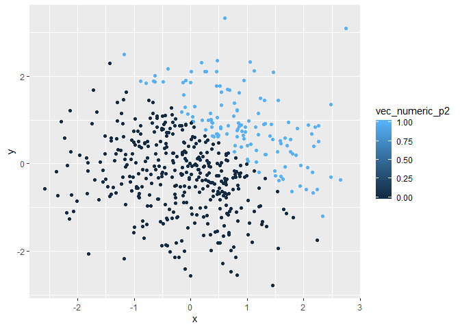
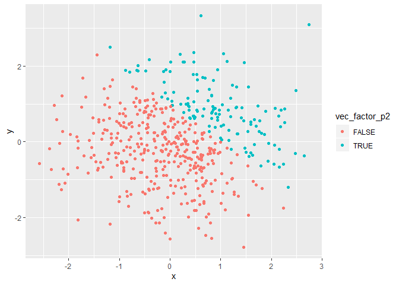

p8105\_HW1\_rat2134
================
Robert Tumasian
9/12/2019

# Homework 1

## Problem 1

**Create a data frame comprised of:**

  - **a random sample of size 8 from a standard Normal distribution**
  - **a logical vector indicating whether elements of the sample are
    greater than 0**
  - **a character vector of length 8**
  - **a factor vector of length 8, with 3 different factor “levels”**

<!-- end list -->

``` r
#Loading required packages
library(tidyverse)
```

    ## -- Attaching packages ----------------------------------------------------------- tidyverse 1.2.1 --

    ## v ggplot2 3.2.1     v purrr   0.3.2
    ## v tibble  2.1.3     v dplyr   0.8.3
    ## v tidyr   0.8.3     v stringr 1.4.0
    ## v readr   1.3.1     v forcats 0.4.0

    ## -- Conflicts -------------------------------------------------------------- tidyverse_conflicts() --
    ## x dplyr::filter() masks stats::filter()
    ## x dplyr::lag()    masks stats::lag()

``` r
set.seed(1234) #Set seed to guarantee reproducible results

#Create data set
Problem1_df=tibble(
  x = rnorm(n = 8, mean = 0, sd = 1),
  vec_logical = c(x > 0),
  vec_char = c("a","b","c","d","e","f","g","h"),
  vec_factor = factor(c("Red","Red","Blue","Red","Green","Green","Red","Red"))
)
```

**Try to take the mean of each variable in your dataframe. What works
and what
    doesn’t?**

``` r
mean(pull(Problem1_df, x))
```

    ## [1] -0.2971355

``` r
mean(pull(Problem1_df, vec_logical))
```

    ## [1] 0.5

``` r
mean(pull(Problem1_df, vec_char)) 
```

    ## Warning in mean.default(pull(Problem1_df, vec_char)): argument is not
    ## numeric or logical: returning NA

    ## [1] NA

``` r
mean(pull(Problem1_df, vec_factor))
```

    ## Warning in mean.default(pull(Problem1_df, vec_factor)): argument is not
    ## numeric or logical: returning NA

    ## [1] NA

We are able to take the mean of `x` and the logical vector, but we
cannot take the mean of the character and factor vectors.

**Write a code chunk that applies the `as.numeric` function to the
logical, character, and factor variables (please show this chunk but not
the output). What happens, and why? Does this help explain what happens
when you try to take the mean?**

``` r
#Converting logical, character, and factor vectors to numeric vectors
as.numeric(pull(Problem1_df, vec_logical))

as.numeric(pull(Problem1_df, vec_char))

as.numeric(pull(Problem1_df, vec_factor))
```

When converting the logical vector to a numeric vector, all `TRUE`
values are assigned to 1s and all `FALSE` values are assigned to 0s.
When converting the character vector to a numerical vector, all elements
become `NA`, since chararcter vectors cannot be enumerated. Lastly, when
the factor vector is converted into a numerical vector, all elements are
enumerated alphabetically (“Blue” = 1, “Green” = 2, and “Red” = 3). It
makes sense that we are only able to take the mean of vectors that are
able to be enuerated (logical and factor vectors), but not vectors that
are unable to be enumerated (character vectors).

**In a second code chunk:**

  - **convert the logical vector to numeric, and multiply the random
    sample by the result**
  - **convert the logical vector to a factor, and multiply the random
    sample by the result**
  - **convert the logical vector to a factor and then convert the result
    to numeric, and multiply the random sample by the
    result**

<!-- end list -->

``` r
as.numeric(pull(Problem1_df, vec_logical)) * pull(Problem1_df, x)
```

    ## [1] 0.0000000 0.2774292 1.0844412 0.0000000 0.4291247 0.5060559 0.0000000
    ## [8] 0.0000000

``` r
as.factor(pull(Problem1_df, vec_logical)) * pull(Problem1_df, x)
```

    ## Warning in Ops.factor(as.factor(pull(Problem1_df, vec_logical)),
    ## pull(Problem1_df, : '*' not meaningful for factors

    ## [1] NA NA NA NA NA NA NA NA

``` r
as.numeric(as.factor(pull(Problem1_df, vec_logical))) * pull(Problem1_df, x)
```

    ## [1] -1.2070657  0.5548585  2.1688824 -2.3456977  0.8582494  1.0121118
    ## [7] -0.5747400 -0.5466319

## Problem 2

**Create a data frame comprised of:**

  - **x: a random sample of size 500 from a standard Normal
    distribution**
  - **y: a random sample of size 500 from a standard Normal
    distribution**
  - **A logical vector indicating whether x + y \> 1**
  - **A numeric vector created by coercing the above logical vector**
  - **A factor vector created by coercing the above logical vector**

<!-- end list -->

``` r
set.seed(12345) #Set seed to guarantee reproducible results

#Create data set
Problem2_df=tibble(
  x = rnorm(n = 500, mean = 0, sd = 1),
  y = rnorm(n = 500, mean = 0, sd = 1),
  vec_logical = c(x + y > 1),
  vec_numeric = as.numeric(vec_logical),
  vec_factor = as.factor(vec_logical)
)
```

**Write a short description of your vector using inline R code,
including:**

  - **the size of the dataset (using `nrow` and `ncol`)**
  - **the mean, median, and standard deviation of `x`**
  - **the proportion of cases for which `x + y > 1`**

This data set has 500 rows and 5 columns. The mean, median, and standard
deviation of `x` are 0.0824608, 0.1024921, and 0.9901489, respectively.
Lastly, the proportion of cases for which `x + y > 1` is 0.26.
Therefore, 26% of the `x + y` values are greater than 1.

**Make a scatterplot of `y` vs `x`; color points using the logical
variable (adding `color = ...` inside of `aes` in your `ggplot` code
should help). Make a second and third scatterplot that color points
using the numeric and factor variables, respectively, and comment on the
color scales.**

``` r
#Scatterplot of y vs x (coloring points using logical variable)
Plot1 = ggplot(Problem2_df, aes(x = x, y = y, color = vec_logical)) + geom_point()
Plot1
```

<!-- -->

In this first plot, the color scale assigns all `FALSE` values in
`vec_logical` to red and all `TRUE` values to blue. Therefore, all `x +
y` values that are greater than 1 will be blue and those that are less
than 1 will be red.

``` r
#Scatterplot of y vs x (coloring points using numeric variable)
Plot2 = ggplot(Problem2_df, aes(x = x, y = y, color = vec_numeric)) + geom_point()
Plot2
```

<!-- -->

Here, the values of `vec_numeric` are assigned on a continuous color
scale, or spectrum. However, since all values of `vec_numeric` are 0 or
1, there are only two point colors displayed in the plot. Dark blue
points represent all points in `vec_logical` that are 0, in which `x + y
< 1`. Similarly, light blue points represent all points in `vec_logical`
that are 1, in which `x + y > 1`.

``` r
#Scatterplot of y vs x (coloring points using factor variable)
Plot3 = ggplot(Problem2_df, aes(x = x, y = y, color = vec_factor)) + geom_point()
Plot3
```

<!-- -->

Lastly, this plot

**Export your first scatterplot to your project directory using
`ggsave`.**

``` r
ggsave(filename = "Problem2_First_Scatterplot.pdf", 
       plot = Plot1,
       height = 4,
       width = 6
)
```
